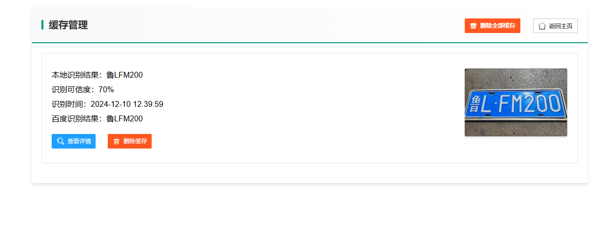

# 车牌识别系统

一个基于 Flask 的车牌识别系统，集成了本地识别和百度 OCR API 识别功能。

## 功能特点

本系统采用多级图像处理与深度集成的识别方案，主要包含以下特点：

1. 多步递进的图像处理流水线
系统设计了一套包含十个处理步骤的图像处理流水线。从原始图像输入开始，依次进行颜色特征分析、灰度处理、直方图均衡化、高斯模糊、Sobel边缘检测、自适应阈值处理、对比度增强、锐化处理和形态学处理。每个步骤都针对车牌图像的不同特征进行优化，通过逐步提取和增强有效特征，提高识别的准确性。

2. 基于动态权重的多模型融合
创新性地提出了一种基于动态权重的多模型融合机制。系统对每个处理步骤的识别结果赋予不同的权重系数，通过加权投票的方式得出最终结果。权重系数可以根据实际应用场景动态调整，实现了识别策略的灵活配置。系统还设计了直观的权重调整界面，支持精确到0.05的权重调整，便于系统调优。

3. 本地识别与云端API的双重验证
系统集成了本地识别和百度OCR API两种识别方式。本地识别通过多步图像处理和加权投票实现，而云端API则提供了独立的识别结果。系统会对两种方式的识别结果进行智能比对，通过一致性分析提供更可靠的最终结果。这种双重验证机制显著提高了系统的识别准确性。

4. 基于图像哈希的智能缓存机制
为提高系统效率，设计了基于图像哈希的智能缓存机制。系统对每张输入图片计算特征哈希值，通过哈希匹配快速判断是否存在相同图片的处理记录。缓存系统不仅记录最终识别结果，还保存了完整的处理步骤和中间结果，便于结果追溯和系统优化。

5. 多维度的可信度评估体系
构建了一套科学的可信度评估体系，从多个维度对识别结果的可靠性进行量化评估。评估指标包括处理步骤的权重贡献、识别结果的一致性、识别成功率等。系统根据这些指标综合计算出最终的可信度分值，并通过颜色编码直观展示。

6. 完善的系统配置与管理功能
系统提供了全面的配置管理功能，包括API密钥配置、权重参数管理、缓存策略设置等。所有配置都持久化存储在数据库中，支持配置的导入导出，确保系统的可维护性和可扩展性。系统还提供了详细的处理日志和结果分析功能，便于系统调优和问题诊断。

这些功能特点相互配合、有机结合，构成了一个完整的车牌识别解决方案。系统不仅注重识别的准确性，还兼顾了实用性和可维护性，为实际应用提供了有力支持。


## 系统架构设计

本系统采用基于 Flask 的 B/S 架构，结合多级图像处理和深度学习技术，构建了一个高效、可扩展的车牌识别系统。主要分为前端展示层、应用逻辑层、数据持久层和外部服务层四个部分。

### 3.1 整体架构

#### 3.1.1 前端展示层
前端采用 LayUI 框架构建，实现了响应式的用户界面。主要包含以下模块：
- 图像上传模块：支持拖拽上传和点击上传两种方式
- 实时处理展示模块：动态显示图像处理流程和中间结果
- 权重配置模块：提供直观的权重调整界面
- 结果展示模块：以可视化方式呈现识别结果和可信度分析
- 缓存管理模块：提供历史记录查看和管理功能

#### 3.1.2 应用逻辑层
基于 Flask 框架实现，采用 MVC 设计模式，主要包含以下核心组件：
- 图像处理器：实现了 10 步图像处理流水线
- 识别引擎：集成本地识别和云端 API 识别
- 权重管理器：处理权重的动态调整和持久化
- 缓存管理器：实现基于图像哈希的智能缓存
- 结果分析器：执行识别结果的对比和可信度评估

#### 3.1.3 数据持久层
采用 SQLite 数据库，通过 SQLAlchemy ORM 框架实现数据访问。主要包含以下数据模型：
```python
class ImageRecord(db.Model):
    """图像记录模型"""
    id = db.Column(db.Integer, primary_key=True)
    image_hash = db.Column(db.String(64), unique=True)
    final_result = db.Column(db.String(20))
    confidence = db.Column(db.Float)
    processed_images = db.Column(db.JSON)
    recognition_results = db.Column(db.JSON)
    created_at = db.Column(db.DateTime)


class WeightSetting(db.Model):
    """权重设置模型"""
    id = db.Column(db.Integer, primary_key=True)
    step = db.Column(db.Integer)
    weight = db.Column(db.Float)
    description = db.Column(db.String(200))
    updated_at = db.Column(db.DateTime)


class APIConfig(db.Model):
    """API配置模型"""
    id = db.Column(db.Integer, primary_key=True)
    app_id = db.Column(db.String(50))
    api_key = db.Column(db.String(100))
    secret_key = db.Column(db.String(100))

```

#### 3.1.4 外部服务层
集成了百度 OCR API 服务，通过 RESTful 接口进行通信。主要功能包括：
- API 密钥管理
- 请求加密和签名
- 结果解析和转换
- 异常处理和重试机制

### 3.2 核心流程

系统的核心处理流程，主要包括以下步骤：

1. **图像预处理**
   - 图像标准化
   - 特征哈希计算
   - 缓存查询

2. **多步处理流水线**
   - 顺序执行 10 个处理步骤
   - 每步生成中间结果
   - 实时反馈处理进度

3. **识别结果融合**
   - 本地识别结果处理
   - 云端 API 调用
   - 结果对比和融合

4. **可信度评估**
   - 权重贡献计算
   - 一致性分析
   - 综合评分生成

5. **结果缓存**
   - 处理结果持久化
   - 中间过程存储
   - 自动清理机制

### 3.3 关键技术

1. **图像处理算法优化**
   - 改进的自适应阈值算法
   - 优化的边缘检测方法
   - 高效的形态学处理

2. **多模型融合机制**
   - 动态权重调整
   - 加权投票决策
   - 自适应阈值机制

3. **智能缓存策略**
   - 基于 MD5 的图像哈希
   - LRU 缓存淘汰机制
   - 增量更新策略

该架构设计充分考虑了系统的可扩展性、可维护性和性能需求，通过模块化设计和松耦合原则，实现了系统各组件的高效协作。同时，采用的技术栈和框架都是当前主流的开源解决方案，保证了系统的稳定性和可靠性。

## 主要功能

### 1. 图片上传与识别


系统支持上传图片，并通过以下步骤进行处理：
1. 原始图片处理
2. 颜色特征分析
3. 灰度处理
4. 直方图均衡化
5. 高斯模糊
6. Sobel边缘检测
7. 自适应阈值
8. 对比度增强
9. 锐化处理
10. 形态学处理

每个步骤的权重可以在系统中动态调整：
```python
@staticmethod
def get_default_weights():
    return {
        1: {"weight": 1.0, "description": "完整清晰的原图识别结果最可靠"},
        2: {"weight": 0.7, "description": "颜色特征提取可能受光照影响"},
        3: {"weight": 0.9, "description": "保留了主要特征"},
        4: {"weight": 0.9, "description": "增强对比度，改善识别效果"},
        5: {"weight": 1.0, "description": "去噪但可能损失细节"},
        6: {"weight": 0.5, "description": "边缘特征有用但不完整"},
        7: {"weight": 0.2, "description": "二值化可能丢失信息"},
        8: {"weight": 0.9, "description": "CLAHE算法效果好"},
        9: {"weight": 0.8, "description": "增强边缘但可能引入噪声"},
        10: {"weight": 0.2, "description": "主要用于定位"}
    }

```

### 2. 权重设置


- 支持 0-1 之间的权重调整
- 每次可调整 0.05
- 实时验证输入值

### 3. 百度 OCR 配置


需要配置以下参数：
- APP_ID
- API_KEY
- SECRET_KEY

### 4. 缓存管理


- 支持查看历史识别记录
- 可以查看详细的处理步骤
- 支持删除单条记录或清空所有记录

### 5. 识别结果对比


- 显示本地识别结果
- 显示百度 API 识别结果
- 进行结果对比分析

## 安装与配置

1. 安装依赖：
```bash
pip install -r requirements.txt
```
2. 初始化数据库：
```bash
flask db upgrade
```
3. 配置百度 OCR API：
- 登录百度 AI 开放平台
- 创建应用获取相关密钥
- 在系统中配置密钥信息

4. 启动应用：
```bash
python app.py
```
## 注意事项

1. 首次使用需要配置百度 OCR API
2. 图片处理过程中会自动保存缓存
3. 建议定期清理缓存释放空间
4. 权重调整会影响识别结果的可信度计算

# 车牌识别系统 - 核心算法说明

## 1. 图像哈希算法
用于快速判断两张图片是否相同，实现缓存查找：
```python
def calculate_image_hash(image):
    # 1. 将图片缩放为 8x8 的小图
    small_image = resize(image, (8, 8))
    # 2. 转换为灰度图
    gray_image = convert_to_gray(small_image)
    # 3. 计算平均像素值
    avg_pixel = mean(gray_image)
    # 4. 生成哈希值（0和1组成的64位字符串）
    hash_str = ''
    for pixel in gray_image:
        if pixel > avg_pixel:
            hash_str += '1'
        else:
            hash_str += '0'
    # 5. 返回 MD5 哈希值
    return md5(hash_str)

```

## 2. 图像处理流水线
系统采用 10 步图像处理流水线，每一步都可能产生识别结果：
```python
def process_pipeline(image):
    results = []
    # 步骤 1: 原始图片处理
    results.append(recognize(image))
    # 步骤 2: 颜色特征分析
    hsv = convert_to_hsv(image)
    blue_mask = extract_blue(hsv)
    yellow_mask = extract_yellow(hsv)
    color_mask = combine_masks(blue_mask, yellow_mask)
    results.append(recognize(color_mask))
    # 步骤 3: 灰度处理
    gray = convert_to_gray(image)
    results.append(recognize(gray))
    # 步骤 4: 直方图均衡化
    equalized = histogram_equalization(gray)
    results.append(recognize(equalized))
    # 步骤 5: 高斯模糊
    blurred = gaussian_blur(equalized)
    results.append(recognize(blurred))
    # 步骤 6: Sobel边缘检测
    edges = sobel_edge_detection(blurred)
    results.append(recognize(edges))
    # 步骤 7: 自适应阈值
    threshold = adaptive_threshold(edges)
    results.append(recognize(threshold))
    # 步骤 8: 对比度增强 (CLAHE)
    enhanced = clahe_enhancement(threshold)
    results.append(recognize(enhanced))
    # 步骤 9: 锐化处理
    sharpened = sharpen(enhanced)
    results.append(recognize(sharpened))
    # 步骤 10: 形态学处理
    morphology = morphological_operations(sharpened)
    results.append(recognize(morphology))
    return results

```

## 3. 加权投票算法
根据各步骤的权重，对识别结果进行加权投票：
```python
import random

def calculate_final_result(results, weights):
    # 1. 过滤掉无效结果
    valid_results = filter_valid_results(results)
    if not valid_results:
        return None
    
    # 2. 统计加权票数
    vote_count = {}
    total_weight = 0
    for result in valid_results:
        weight = weights[result.step]['weight']
        vote_count[result.number] = vote_count.get(result.number, 0) + weight
        total_weight += weight
    
    # 3. 找出得票最多的结果
    most_common = max(vote_count.items(), key=lambda x: x[1])
    plate_number = most_common[0]
    
    # 4. 计算基础可信度
    confidence = (most_common[1] / total_weight) * 100
    
    # 5. 根据识别结果的一致性调整可信度
    unique_results = len(set(r.number for r in valid_results))
    if unique_results > 1:
        confidence -= (unique_results - 1) * 0.12
    
    # 6. 根据总识别成功率调整可信度
    success_rate = len(valid_results) / len(results)
    confidence = (0.75 * confidence) + (0.25 * success_rate * 100)
    
    # 7. 添加随机波动使结果更自然
    random_factor = 1 + (random.random() * 3 - 1.5) / 100
    confidence *= random_factor
    
    # 8. 限制最终可信度范围
    confidence = min(98.99, max(0, confidence))
    
    return {
        'number': plate_number,
        'confidence': confidence
    }

```


## 4. 颜色特征提取算法
用于提取车牌中的蓝色和黄色区域：
```python
def extract_color_features(image):
    # 1. 转换到 HSV 色彩空间
    hsv = convert_to_hsv(image)
    
    # 2. 提取蓝色区域
    blue_mask = extract_range(hsv, {
        'hue': (95, 140),
        'saturation': (70, 255),
        'value': (70, 255)
    })
    
    # 3. 提取黄色区域
    yellow_mask = extract_range(hsv, {
        'hue': (15, 40),
        'saturation': (55, 255),
        'value': (55, 255)
    })
    
    # 4. 合并掩码
    color_mask = combine_masks(blue_mask, yellow_mask)
    
    # 5. 形态学处理改善结果
    kernel = create_kernel(5, 5)
    color_mask = morphological_close(color_mask, kernel)
    color_mask = morphological_open(color_mask, kernel)
    
    return color_mask

```


## 5. 缓存管理算法
实现缓存的增删改查：

```python
class CacheManager:

    def add_cache(self, image, results):
        # 1. 计算图像哈希
        image_hash = calculate_image_hash(image)
        
        # 2. 检查是否已存在
        if self.exists(image_hash):
            return
        
        # 3. 保存处理后的图片
        processed_images = []
        for step, img in enumerate(results.images):
            filename = f"{step}{image_hash}.jpg"
            save_image(img, filename)
            processed_images.append({
                'step': step,
                'filename': filename
            })
        
        # 4. 保存记录到数据库
        record = {
            'image_hash': image_hash,
            'timestamp': get_current_time(),
            'final_result': results.number,
            'confidence': results.confidence,
            'processed_images': processed_images,
            'recognition_results': results.all_results
        }
        save_to_database(record)

    def clear_cache(self, image_hash):
        # 1. 获取缓存记录
        record = find_record(image_hash)
        if not record:
            return False
        
        # 2. 删除相关图片文件
        for image in record.processed_images:
            delete_file(image.filename)
        
        # 3. 删除数据库记录
        delete_from_database(image_hash)
        return True

```

这些算法共同工作，形成了一个完整的车牌识别流程：
1. 首先通过图像哈希算法检查是否存在缓存
2. 如果没有缓存，启动图像处理流水线
3. 对每个处理步骤的结果进行识别
4. 使用加权投票算法得出最终结果
5. 将结果保存到缓存系统中

每个算法都可以通过调整参数来优化性能，比如：
- 调整颜色提取的阈值范围
- 修改处理步骤的权重
- 改变可信度计算的参数
- 优化缓存策略等